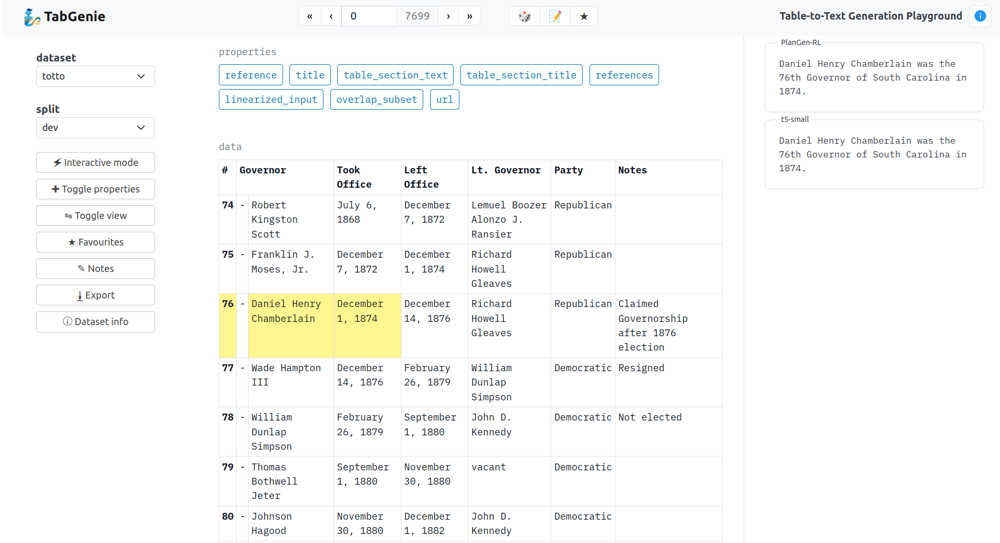

# 🧞 TabGenie

Interaction and exploration platform for table-to-text generation datasets.

Work in progress.

The README currently serves as developer guidelines. Note that the information may get outdated during the app development.

## Project overview
TabGenie is a web application for exploring and interacting with **table-to-text generation datasets** and the related **processing pipelines**.

The app demo is running at https://quest.ms.mff.cuni.cz/rel2text/tabgenie.

**Frontend Preview**



At the moment, the application provides access to 12 existing **datasets**. Each dataset contains train / dev / test splits. The datasets are loaded from the [HuggingFace datasets](https://huggingface.co/datasets).

Each table in a dataset is displayed in a standard matrix format:
- each table contains M rows and N columns,
- cells may span multiple columns or rows,
- cells may be marked as headings (indicated by bold font),
- cells may be highlighted (indicated by yellow background).

Additionally, each example may contain metadata (such as title, url, etc.) which are displayed next to the main table as *properties*.

The tables are processed with **pipelines**. The input of each pipeline is the dataset table with the associated meta-information and the output is a HTML snippet. The outputs of pipelines are displayed in the right panel.

## Quickstart
### Requirements
- Python 3
- Flask
- HuggingFace datasets

See `setup.py` for the full list of requirements.

### Web app
#### Local development
```
pip install -e .
tabgenie run [--port=PORT] [--host=HOSTNAME]
```
#### Deployment
```
pip install -e .[deploy]
gunicorn "src.tabgenie.cli:create_app()"
```

### CLI
#### Dataset export
```
pip install -e .
tabgenie export -d DATASET_NAME -o OUTPUT_FILE [-s SPLIT] [-t TEMPLATE]
```

## Datasets

See `src/loaders/data.py` for an up-to-date list of available datasets.
- **DART** - https://github.com/Yale-LILY/dart
- **E2E** - https://github.com/tuetschek/e2e-cleaning
- **HiTab** - https://github.com/microsoft/HiTab
- **ChartToTextS** - https://github.com/vis-nlp/Chart-to-text/tree/main/statista_dataset/dataset
- **Logic2Text** - https://github.com/czyssrs/Logic2Text
- **LogicNLG** - https://github.com/wenhuchen/LogicNLG
- **NumericNLG** - https://github.com/titech-nlp/numeric-nlg
- **SciGen** - https://github.com/UKPLab/SciGen
- **SportSettBasketball** - https://github.com/nlgcat/sport_sett_basketball
- **ToTTo** - https://github.com/google-research-datasets/ToTTo
- **WebNLG** - https://gitlab.com/shimorina/webnlg-dataset/-/tree/master/release_v3.0
- **WikiBio** - https://github.com/DavidGrangier/wikipedia-biography-dataset


The datasets are all loaded from [HuggingFace datasets](https://huggingface.co/datasets) instead of their original repositories. This allows to use preprocessed datasets and a single unified loader.

Note that there may be some minor changes in the data w.r.t. to the original datasets due to unification, such as adding "subject", "predicate" and "object" headings to RDF triple-to-text datasets.

The metadata for each table are displayed as `properties` next to the main table.

### Adding datasets
For adding a new dataset:
- create a file in `src/loaders` containing the dataset class,
- add the mapping between dataset name and class name to `get_dataset_class_by_name()` in `src/loaders/data.py`. 

The file `data.py` also contains parent classes for the datasets and auxiliary data structures. 

Each dataset should contain the `prepare_table(split, table_idx)` method which instantiates a `Table` object from the raw data saved in `self.data`.

The `Table` object is automatically exported to HTML and other formats (the methods may be overridden).

If a dataset is an instance of `HFTabularDataset` (i.e. is loaded from Huggingface Datasets), it should contain a `self.hf_id` attribute. The attribute is used to automatically load the dataset via `datasets` package.

## Pipelines
Pipelines are used for processing the tables and producing outputs.

See `src/processing/processing.py` for an up-to-date list of available pipelines.
- **translate** - an example pipeline which translates the table title via an API,
- **model_api** - a pipeline which generates a textual description of a table by calling a table-to-text generation model through API,
- **model_local** - a pipeline which generates a textual description of a table using a locally loaded table-to-text generation model,
- **graph** - a pipeline which creates a knowledge graph by extracting RDF triples from a table and visualizes the output using D3.js library,
- **reference** - a pipeline which returns the reference textual description of a table.

### Adding pipelines
For adding a new pipeline:
- create a file in `src/processing/pipelines` containing the pipeline class,
- create file(s) in `src/processing/processors` with processors needed for the pipeline,
- add the mapping between pipeline name and class name to `get_pipeline_class_by_name()` in `src/processing/processing.py`. 

Each pipeline should define `self.processors` in the `__init__()` method, instantiating the processors needed for the pipeline.

The input to each pipeline is a `content` object containing several fields needed for table processing. This interface is subject to change (see `src/__init.py_:run_pipeline()` for more details).

The processors serve as modules, i.e. existing processors can be combined to create new pipelines. The interface between the processors may vary, it is however expected that the last processor in the pipeline outputs HTML code which is displayed on the page.

## Configuring the app
The global configuration is stored in the `config.json` file. The values are available during runtime through `app.config` dictionary.

- `datasets` - datasets which will be available in the web interface,
- `default_dataset` - the dataset which is loaded by default,
- `max_examples_per_split` - maximum number of examples loaded for each dataset split (for HF datasets implemented using HF [Slicing API](https://huggingface.co/docs/datasets/v1.11.0/splits.html))
- `host_prefix` - subdirectory on which the app is deployed (used for loading static files and sending POST requests),
- `preload` - whether to preload all available dev sets after startup,
- `pipelines` - pipelines which will be available in the web interface,
- `pipeline_cfg` - pipeline-specific configurations.

Note that the config file is parsed using [pyjson5](https://pypi.org/project/pyjson5/) and can thus contain comments.